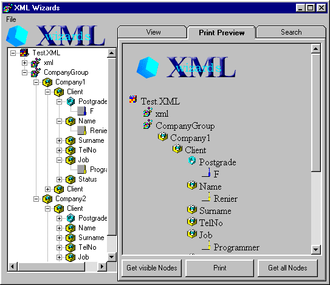



## XML Viewer/Printer Uses the DOM to parse into a treeview and generate HTML for printing

### Description

Views and Prints XML documents. Uses the DOM to do the parcing and then builds a treeview. It also generates a Print and Print Preview. Good code.I have already started on the editor functions. Editing can be done straight from the treeview.
 
### More Info
 
Must reference to MSXML.DLL (the DOM object) in System Directory (Comes with ie5)

             |
---                |---
**Submitted On**   |2000-09-26 13:25:04
**By**             |[N/A](https://github.com/Planet-Source-Code/PSCIndex/blob/master/ByAuthor/empty.md)
**Level**          |Advanced
**User Rating**    |4.0 (24 globes from 6 users)
**Compatibility**  |VB 6\.0
**Category**       |[Complete Applications](https://github.com/Planet-Source-Code/PSCIndex/blob/master/ByCategory/complete-applications__1-27.md)
**World**          |[Visual Basic](https://github.com/Planet-Source-Code/PSCIndex/blob/master/ByWorld/visual-basic.md)
**Archive File**   |[CODE\_UPLOAD101669262000\.zip](https://github.com/Planet-Source-Code/xml-viewer-printer-uses-the-dom-to-parse-into-a-treeview-and-generate-html-for-printing__1-11673/archive/master.zip)

